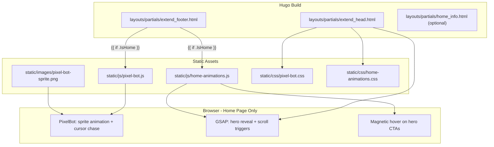

# AI Pixel Bot + Animated Home Portfolio

## Top 5 Portfolio Inspirations (from [developer-portfolios](https://github.com/emmabostian/developer-portfolios))

Curated for a **Platform Engineer / Cloud Native** profile like yours:


| #   | Portfolio            | URL                                                                                                                | Why it stands out for you                                                                                                                                                       |
| --- | -------------------- | ------------------------------------------------------------------------------------------------------------------ | ------------------------------------------------------------------------------------------------------------------------------------------------------------------------------- |
| 1   | **Atanu Biswas**     | [atanu-portfolio-devsecops-production.up.railway.app](https://atanu-portfolio-devsecops-production.up.railway.app) | DevSecOps engineer with live **CI/CD pipeline simulator**, interactive topology map, terminal aesthetic, and skill matrix — closest match to your K8s/OpenShift/Terraform stack |
| 2   | **Puja Sridhar**     | [pujasridhar.github.io](https://pujasridhar.github.io)                                                             | **AI bot assistant "Cogsworth"** in a terminal UI — answers from real portfolio data; strong AI-agent branding                                                                  |
| 3   | **Aman Kumar Jha**   | [Amanbuilds.me](https://Amanbuilds.me)                                                                             | Animated AI engineer portfolio — **GSAP scroll storytelling**, neobrutalist cards, marquee text, agentic-coding theme (marked "Animated" in the list)                           |
| 4   | **Aakhand Tajmirul** | [tajmirul.site](https://www.tajmirul.site)                                                                         | Clean frontend portfolio with **GSAP + Framer Motion** scroll reveals and polished micro-interactions (marked "Animated" in the list)                                           |
| 5   | **Adham Dannaway**   | [adhamdannaway.com](https://www.adhamdannaway.com)                                                                 | Legendary **split-personality UX design** — proves creative differentiation without heavy tech; timeless inspiration for standing out                                           |


**Your reference bot** ([aifinancemaster.com/#author](https://aifinancemaster.com/#author)): anchored character with **eye/head tracking** toward cursor — we'll adapt this behavior into a **walking pixel sprite** per your preference.

---

## Your Choices (confirmed)

- **Character**: Retro pixel companion (sprite-sheet, walks toward cursor)
- **Scope**: Home page only — passive follower + idle animations, no chat
- **Extras**: GSAP scroll animations + magnetic hover effects

---

## Current Codebase

- **Stack**: Hugo v0.164 + PaperMod theme ([hugo.toml](hugo.toml))
- **Extension points**: Empty project-level `[layouts/](layouts/)`, `[static/](static/)`, `[assets/](assets/)` — PaperMod already loads `[extend_head.html](themes/PaperMod/layouts/_partials/extend_head.html)` and `[extend_footer.html](themes/PaperMod/layouts/_partials/extend_footer.html)` from project overrides
- **Home hero** configured via `[params.homeInfoParams]` in [hugo.toml](hugo.toml) — rendered by theme partial `home_info.html`

---

## Architecture




---

## Implementation Plan

### 1. Pixel Bot Cursor Follower (home only)

Create `[static/js/pixel-bot.js](static/js/pixel-bot.js)` — vanilla JS, no React/npm (Hugo-friendly adaptation of [cursor-pet](https://github.com/iampankajghosh/cursor-pet) logic):

- **Sprite sheet**: 4-direction walk cycle (down/left/right/up) + idle blink frames in `[static/images/pixel-bot-sprite.png](static/images/pixel-bot-sprite.png)`
- **Character theme**: Cloud-native pixel robot — hexagonal visor, K8s-wheel badge on chest (platform engineer identity)
- **Movement**: Lerp-based chase toward cursor with `reactionDelay`, `stopDistance`, direction-aware frame selection
- **Eye tracking**: Sub-sprite eye offset toward cursor when idle (aifinancemaster-style "looking around")
- **Canvas overlay**: Fixed-position `<canvas>` appended to body; `pointer-events: none` so it never blocks clicks
- **Home spawn point**: Starts near hero text (bottom-right of `.home-info` block), returns home when cursor leaves viewport
- **Accessibility**:
  - Skip entirely on touch devices (`matchMedia('(pointer: coarse)')`)
  - Respect `prefers-reduced-motion: reduce` — show static idle frame only
  - `Alt+C` keyboard toggle to hide/show bot

Create `[static/css/pixel-bot.css](static/css/pixel-bot.css)` for canvas positioning and z-index (above content, below modals).

### 2. GSAP Home Animations

Create `[static/js/home-animations.js](static/js/home-animations.js)`:

- Load **GSAP 3 + ScrollTrigger** via CDN in extend_head (home page conditional)
- **Hero entrance** (on `.home-info`):
  - Title characters stagger in (split text manually or via `SplitText`-free char wrap)
  - Subtitle/content fade-up with 0.1s stagger
  - Social icons scale-in
- **Scroll reveals** (on post entries / recent sections if present):
  - `.post-entry` cards fade + translateY on ScrollTrigger enter
- **Magnetic hover** on hero links and nav items within home:
  - Buttons pull toward cursor within ~30px radius (transform on mousemove, spring back on leave)

Create `[static/css/home-animations.css](static/css/home-animations.css)` for initial hidden states (`opacity: 0` on animated elements — GSAP reveals them; with reduced-motion, CSS sets `opacity: 1` immediately).

### 3. Hugo Partial Overrides

`**[layouts/partials/extend_head.html](layouts/partials/extend_head.html)**`:

```html
{{ if .IsHome }}
<link rel="stylesheet" href="/css/pixel-bot.css">
<link rel="stylesheet" href="/css/home-animations.css">
<script src="https://cdn.jsdelivr.net/npm/gsap@3/dist/gsap.min.js" defer></script>
<script src="https://cdn.jsdelivr.net/npm/gsap@3/dist/ScrollTrigger.min.js" defer></script>
{{ end }}
```

`**[layouts/partials/extend_footer.html](layouts/partials/extend_footer.html)**`:

```html
{{ if .IsHome }}
<script src="/js/pixel-bot.js" defer></script>
<script src="/js/home-animations.js" defer></script>
{{ end }}
```

Optional: override `[layouts/partials/home_info.html](layouts/partials/home_info.html)` to add CSS hooks (`.home-info`, `.hero-title`, `.hero-content`) without forking the full theme.

### 4. Sprite Asset

Design a **32x32px per frame** sprite sheet (platform-engineer pixel bot):

- Row 0: idle (4 frames, includes blink)
- Rows 1–4: walk down, left, right, up (4 frames each)
- Total sheet: ~320x128px PNG with transparent background

If no custom art is provided, ship a clean default robot sprite and leave a comment in code for easy sprite swap.

### 5. Performance and Compatibility

- Target **60fps** via `requestAnimationFrame`; only redraw canvas when position/frame changes
- Total added weight: ~~8KB JS + ~4KB sprite + GSAP CDN (~~45KB gzipped, cached)
- Works with PaperMod dark/light toggle — sprite designed with colors visible on both themes
- No changes to theme submodule — all overrides in project root

---

## Files to Create/Modify


| File                                  | Action                                        |
| ------------------------------------- | --------------------------------------------- |
| `layouts/partials/extend_head.html`   | Create — conditional CSS + GSAP               |
| `layouts/partials/extend_footer.html` | Create — conditional JS                       |
| `layouts/partials/home_info.html`     | Create (optional) — add animation class hooks |
| `static/js/pixel-bot.js`              | Create — cursor follower engine               |
| `static/js/home-animations.js`        | Create — GSAP scroll + magnetic               |
| `static/css/pixel-bot.css`            | Create — bot canvas styles                    |
| `static/css/home-animations.css`      | Create — animation initial states             |
| `static/images/pixel-bot-sprite.png`  | Create — pixel sprite sheet                   |


**No changes** to [hugo.toml](hugo.toml) or theme submodule required.

---

## Test Plan

1. Run `hugo server -D` and verify bot appears **only on `/`**
2. Move cursor — bot walks toward it, switches direction frames, eyes track when idle
3. Navigate to `/about/` — bot and GSAP scripts **not loaded**
4. Toggle dark/light theme — sprite remains visible
5. Enable `prefers-reduced-motion` in OS — static idle frame, no GSAP motion
6. Test on mobile viewport — bot hidden, hero content fully visible
7. Press `Alt+C` — bot toggles off/on
8. Verify no console errors; Lighthouse performance stays acceptable

---

## Future Enhancements (out of scope for this pass)

- Contextual speech bubbles on Projects page (Puja Sridhar / Atanu Biswas inspiration)
- Interactive CI/CD pipeline demo section
- Terminal-style About page (`terminal.iabhinav.me` inspiration)
- Expand bot to other pages once home experience is polished

